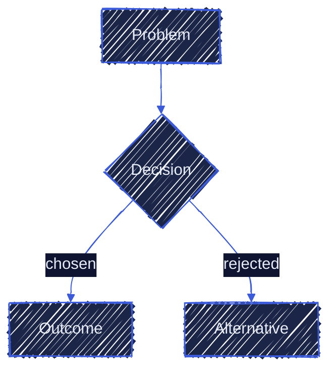

# Imagery & Illustration Standards

Research artefact for chunk 4a.3. Feeds into:
- **4a.4** — merged into `.claude/rules/writing-style.md` as the "Imagery & illustration standards" section (workspace repo, auto-loaded for prose work).
- **4c** — layout mockups treat imagery slots per these rules.
- **4d** — the-weekly case study workshop uses this as the imagery spec.

Not a style-guide replacement. The final workspace-wide rules live in `writing-style.md`; this doc is the reasoning and the references behind them.

---

## Aesthetic direction

**One sentence:** Cutler-influenced sketch aesthetic for diagrams, Royal Tonal-framed screenshots of real artefacts, verbatim chat transcripts as a first-class artefact type, no figurative illustration.

The portfolio is a product-thinking portfolio, not an illustrated essay collection. Diagrams earn their place by replacing paragraphs, not by decorating them. Screenshots show real things that actually shipped. Chat transcripts show real decision moments from real sessions — unedited, un-paraphrased, captured in-flow. Everything else is absent on purpose.

**Two influences to borrow from, one to ignore:**

| Influence | What we take | What we don't |
|---|---|---|
| Cutler (TBM) | Diagram archetypes, placement rule, sketch linework, monochrome palette | TBM numbering, framework-heavy default shape |
| Maggie Appleton | "Image before interpretive text" rule | Vector polish, saturated palette, figurative illustration (Dylan isn't an illustrator) |
| Stripe / Linear marketing | (Nothing directly — their polish is a counter-reference) | Gradient-heavy hero imagery, marketing-site glossiness |

The tension between Cutler ("I drew this to think") and Maggie ("I drew this to teach") is resolved in favour of Cutler because the portfolio is narrating decisions, not explaining abstract concepts. Cutler's raw sketch signals the thing he drew to think on. Maggie's polished illustration signals the thing she drew to teach from. Dylan's case studies are closer to the former.

---

## Diagrams

### Four archetypes (from voice research, Cutler-derived)

These are the only four shapes used in the portfolio. New archetypes require explicit justification — the cost of inventing new ones is that readers lose the ability to pattern-match.

1. **Flowchart / process diagram** — for sequences and decision paths. The default choice when in doubt. Covers most Process section needs in case studies.
2. **2×2 matrix** — for separating concerns along two independent axes. Use when an idea has exactly two dimensions and both matter.
3. **Causal loop / system-dynamics** — for self-reinforcing cycles. Use sparingly; the shape is dense and needs a prepared reader.
4. **Network / constellation** — for "here's the messy reality" moments. The 24-goal network in Cutler's goal-cascades post is the reference.

No bar charts, no line charts, no pie charts, no radar charts. If a number needs to land, state it inline in prose, not as a chart. Charts are for data analysis pieces, which the portfolio does not ship.

### Placement rule (non-negotiable)

**Diagrams appear before the paragraph that interprets them, never after.** This is the single most distinctive Cutler move and it's lockable as a rule because the reason is transferable: visual pattern recognition primes comprehension. Readers see the thing, feel the tension, then get language to describe what they already sensed.

Violations: a diagram that supports a claim made above it is a decoration, not a diagram. Move it up or cut it.

### Caption rule

Captions describe what the diagram **shows**, never what it **means**. Meaning lives in the prose immediately below. Captions are one short sentence, in mono (Geist Mono) at caption size, muted colour. Examples:

- ✓ "Prioritisation flow after consolidating the ingredient list."
- ✗ "Consolidating ingredients reduced decision friction by 40%." (This is interpretation — belongs in body prose.)

### Linework and palette

- **Line style:** sketch / hand-drawn, never vector-perfect. The `look: handDrawn` Mermaid setting powered by RoughJS provides this automatically for flowcharts; Excalidraw is hand-drawn by default.
- **Colour:** monochrome or single primary only. The default is Royal Tonal step 500 (the anchor `#3B5BDB`) on a dark-mode background. Never a rainbow taxonomy — nodes are differentiated by shape or position, not hue. If a second colour is genuinely needed for contrast, use Royal Tonal step 300 (lighter) or step 700 (deeper), never a new hue.
- **Typography:** Geist (sans body font) for all labels. No handwriting fonts — they read as affected. Label size tracks the body text, never larger.
- **Fill:** transparent or dark-mode background colour (never white). Nodes use Royal Tonal 900 as fill with 500 as stroke.

### Diagram tooling — hybrid Mermaid + Excalidraw

**Flowcharts → Mermaid CLI.** Text-sourced, reproducible, diffable in git. Uses the `look: handDrawn` theme (RoughJS-powered) with a custom `themeCSS` that maps Mermaid's internal variables to Royal Tonal tokens.



Render:
```bash
mmdc -i diagrams-src/the-weekly-consolidation.mmd \
     -o src/assets/diagrams/the-weekly-consolidation.svg \
     --backgroundColor transparent
```

Source (`.mmd`) lives in `diagrams-src/`, output SVG lives in `src/assets/diagrams/`, both committed. Regeneration is deterministic via the `handDrawn` seed config (seed 1, not 0, to avoid randomisation between runs).

**2×2 matrices, causal loops, networks → Excalidraw.** Excalidraw's native aesthetic is already hand-drawn. Draw in the Excalidraw web app, export both `.excalidraw` (JSON source) and `.svg`. Both committed. Source file allows future iteration without redrawing.

Configure Excalidraw to use a custom theme matching Royal Tonal:
- Background: `#0F1530` (royal-950)
- Stroke: `#3B5BDB` (royal-500)
- Fill: `#1B2547` (royal-900)
- Font: "Normal" option in Excalidraw (closest to Geist visually)

**Why hybrid:** flowcharts change often during case study iteration and editing text is faster than editing shapes. Non-flowchart diagrams change rarely and the visual-editing benefits of Excalidraw outweigh the text-source advantage. Single-tool approaches all have a forced compromise somewhere.

### Workflow target

From "I need a diagram" to "polished SVG committed" in under 10 minutes:

1. Decide the archetype (30 seconds).
2. For flowcharts: write the Mermaid source (3-5 minutes). Run `mmdc` (5 seconds). Review SVG in browser (30 seconds). Iterate or commit.
3. For other archetypes: open Excalidraw, sketch (5-8 minutes), export SVG + `.excalidraw`, commit.

If a diagram is taking longer than 10 minutes, the archetype is probably wrong — try forcing it into a flowchart shape and see if it resolves.

---

## Screenshots

### What counts as a screenshot

Real UI of real things that shipped or exist. Specifically:

- Running apps (case study subject projects)
- Terminal output from real commands
- Code editors with real code
- Data artefacts (CSV previews, JSON, Mermaid source) displayed in a real viewer
- Deployed sites (own or third-party when legally clear and credited)

Not screenshots:
- Figma / Sketch mockups of features that don't exist yet
- Marketing-site style hero renders
- Anything assembled in a design tool pretending to be real UI

### Capture layer — Puppeteer script (deferred to 4d)

When case study imagery is actually needed in chunk 4d, a Puppeteer script captures raw screenshots of live or locally-served apps. Raw means: just the pixels, no frame, no shadow, no gradient background.

Script location: `scripts/capture-screenshots.ts` in the portfolio repo. Config is an inline array of `{ url, out, viewport }` tuples. Viewport variants:
- Desktop: 1440×900
- Mobile: 390×844
- Retina: `deviceScaleFactor: 2` always

Output: WebP at quality 90. WebP is 30-50% smaller than PNG for UI screenshots and has universal 2026 support.

The script is **not** built in chunk 4a. It gets built once in chunk 4d against the first real case study (the-weekly), then becomes the template for the rest.

### Framing layer — Astro `<Screenshot>` component

Framing is never baked into the screenshot file. It's applied at render time by a single Astro component. This keeps raw captures small, makes frame iteration free, and guarantees consistency.

Component lives at `src/components/Screenshot.astro`. Built in chunk 4c alongside the layout mockups, so every layout can use it.

**Frame specification** (the values the component uses):

| Property | Value | Reason |
|---|---|---|
| Background | `linear-gradient(135deg, var(--color-royal-950), var(--color-royal-900))` | Tonal-shift not hue-shift, stays on-brand |
| Outer radius | 16px | Matches portfolio card radius scale |
| Desktop padding | 32px on all sides | Enough gradient visible without drowning the content |
| Mobile padding | 20px on all sides | Proportional to smaller viewport |
| Inner radius (image edge) | 8px | Matches shadcn new-york-v4 default |
| Border (image edge) | 1px solid `var(--color-royal-800)` | Prevents the screenshot bleeding into dark backgrounds |
| Shadow | `0 20px 60px -20px rgba(0, 0, 0, 0.6)` | Soft, long shadow — "floating panel" not "sticker" |
| Caption font | Geist Mono at `--text-caption` | Consistent with Cutler diagram caption rule |
| Caption colour | `var(--color-text-muted)` | Secondary importance |
| Caption position | Below frame, centred | Standard figure pattern |

**Size variants:** `full` (100% of content column) and `half` (two side-by-side). The component accepts a `size` prop; CSS handles the rest.

**Edge case — OG / social-share images.** These are loaded outside the site, so they need the frame baked in. Solved by a second Puppeteer pass that screenshots the rendered Astro page's `<Screenshot>` component at 1200×630. Generates pre-framed WebPs into `src/assets/og/`. Deferred to chunk 6 when OG cards are in scope.

### Code-specific screenshots — Ray.so exception

For screenshots of code specifically (not UI), Ray.so is explicitly allowed as an alternative to Puppeteer + VS Code capture. Reason: Ray.so is genuinely the best tool for code screenshots — syntax highlighting, window chrome, padding, and dark-mode presets are all first-class. Puppeteer-capturing VS Code would reproduce 80% of this badly.

**Rules for Ray.so code screenshots:**
- Theme: "Vercel" dark (closest tonal match to Royal Tonal).
- Background: transparent or plain Royal Tonal 950 — no Ray.so gradients. The Astro `<Screenshot>` component provides the gradient consistently.
- Title bar: hidden unless the code genuinely needs a filename label.
- Padding: 32 (matches the Astro frame inner padding so visual rhythm stays consistent).

Exported PNGs get wrapped in the same `<Screenshot>` component as Puppeteer captures. No separate code-frame component — one frame rules them all.

**Carbon** is an acceptable substitute for Ray.so if Ray.so is down or missing a language. Same rules.

---

## Chat transcripts

Verbatim snippets from Claude Code sessions are a **first-class artefact type**, not a novelty. The portfolio is largely about the journey of learning to ship with Claude Code, so showing real dialogue — real decision moments, real pivots, real mistakes — is the strongest available product-thinking signal. A paraphrased or fabricated exchange is worse than none at all.

### What counts as a transcript

Real Claude Code session turns captured via the bookmark workflow (chunk 4a.6). Specifically:

- User prompts and assistant replies from a real session, unedited text
- Tool calls **collapsed** to a one-line label (`[Read package.json]`, `[Edit src/foo.ts]`) — never expanded JSON
- Optional inline note/annotation from Dylan explaining *why* this moment was marked

Not transcripts:
- Paraphrased or tidied-up versions of conversations
- Fabricated dialogue for illustrative purposes
- Transcripts from other AI tools (ChatGPT, Cursor) — this portfolio is about Claude Code specifically
- Terminal-only shell session captures (those are screenshots, use Ray.so)

### Why verbatim and nothing else

The credibility of a transcript embed comes entirely from its rawness. The moment a reader suspects it's been polished, the signal inverts — it starts reading like a marketing asset. Rules:

- **Never edit turn text** beyond the redaction pass below
- **Never reorder turns**
- **Never combine turns from different sessions** into one embed
- **Never add turns that didn't happen**

If the real transcript doesn't make the point, don't fabricate — either pick a different moment or tell the story in prose without the embed.

### Redaction rules (automated pass, then hand-review)

The capture workflow runs an automated regex pass before writing the draft:

- **Secrets:** `sk-…`, `ghp_…`, `AKIA…`, anything matching obvious token prefixes → replaced with `[REDACTED]`
- **Absolute Windows paths:** `C:\Users\User\…` → `~/…` (keeps the relative shape, hides the home dir)
- **Email addresses:** replaced with `[redacted-email]`
- **Real names** other than Dylan's: caught on hand-review, not automated

Hand-review is mandatory after the automated pass. The draft lives in `src/content/transcripts/drafts/` until it's been reviewed; only then does it move to `src/content/transcripts/`. No exceptions — a transcript that hasn't been hand-reviewed must not appear in a published page.

### Embed length — min 2, max ~8 turns

- **Fewer than 2 turns** is a quote, not a transcript. Use a pull-quote styled block instead.
- **More than 8 turns** loses the reader. Pick the pivotal sub-range, or split into two separate embeds with prose between them.
- Tool calls count as zero turns for this budget — only user/assistant prose counts.

The `/bookmark` skill defaults to capturing the last 6 turns, which hits this range comfortably.

### Frame specification — `<ChatTranscript>` component

Built in chunk 4c.1 alongside the layout mockups. Two display modes, selected via a `mode` prop:

| Property | `inline` | `breakout` |
|---|---|---|
| Width | Prose column (matches body text) | Wider than prose (extends into the right margin on desktop) |
| Use when | Showing a routine decision or small exchange | Showing the pivotal moment of the case study |
| Per case study | Up to 2 | Max 1 |
| Mobile behaviour | Unchanged | Collapses to prose-column width, same as inline |

Shared frame values:

| Property | Value | Reason |
|---|---|---|
| Background | `var(--color-royal-950)` (darker than screenshot frame) | Distinct visual register — "this is a different medium" |
| Outer radius | 12px | Slightly tighter than screenshot's 16px, reads as "dialogue box" not "photo" |
| Padding | 24px all sides | Room for sender labels without feeling cramped |
| Sender label font | Geist Mono at caption size | Consistent with captions elsewhere |
| User sender label | "Dylan" in Royal Tonal 300 | Warm accent, slightly lighter than body |
| Assistant sender label | "Claude" in Royal Tonal 500 | Core brand accent — anchor colour of the palette |
| Turn separator | 1px hairline in Royal Tonal 900 | Quiet, not a box-in-box |
| Turn text font | Geist (sans body) at body size | Readable, not "chat bubble" styled |
| Tool-call label | Geist Mono at caption size, Royal Tonal 700 | Visibly lesser — "this happened but it's not the point" |
| Annotation margin note | Geist Mono at caption size, italic, Royal Tonal 400 | Hand-written feel without an actual handwriting font |
| Max height | None — transcripts are never scroll-trapped | Scroll-within-scroll is a UX failure |

### MDX usage pattern

```mdx
<ChatTranscript id="the-weekly-pivot" mode="breakout" />
```

Astro resolves the `id` against the `transcripts` content collection (Zod schema, validated at build). `mode` defaults to `inline`. Any additional prop validation is the component's responsibility.

### Banlist additions (extends the Sourcing rules below)

**Banned for transcripts specifically:**
- Any non-verbatim content (edited, paraphrased, reconstructed from memory)
- Transcripts from other tools presented as Claude Code
- Transcripts with unredacted secrets, paths, or PII
- Transcripts with fewer than 2 turns of real dialogue

### Where transcripts live in case studies

Per chunk 4b rules, transcripts are only allowed in **Process** (showing a decision moment) or **Lessons** (showing the mistake). Never in Hero, Problem, or Outcome sections — those are claim sections, and a transcript embed in a claim section invites the reader to scan the dialogue for validation instead of trusting the prose.

---

## Illustrations — deliberately absent

No figurative illustrations. No characters, no scenes, no hand-drawn metaphors. Reasoning:

1. Dylan is not an illustrator. Attempting figurative illustration without the skill tells the reader "this person cares about aesthetics but can't deliver them" — a strictly worse signal than having no illustration at all.
2. Commissioning is expensive and slow. Not a reasonable default for a content-first portfolio.
3. AI-generated illustration has an AI tell now (the gloss, the too-even composition, the extra fingers). Even when it's good, the reader has learned to mistrust it. Not worth the risk.
4. Diagrams + screenshots cover every visual need the case studies have. Adding illustrations would be decoration, not communication.

### The exception — typographic essay covers (if needed)

If writing posts (chunk 5.5) need a visual cover for social sharing, use a **typographic cover**: large Fraunces title on a Royal Tonal gradient block, no figurative element. Optional: a single geometric shape (circle, hexagon, grid line) as accent.

Covers are generated with the same Puppeteer screenshot approach — screenshot a rendered Astro page at 1200×630. No separate illustration pipeline.

Deferred to chunk 5.5.

---

## Sourcing rules (the banlist)

Explicit rules for what is and isn't allowed. Violations are editorial failures that erode credibility.

**Banned:**
- Generic stock photography (Unsplash, Pexels, Getty, anything that isn't of a real thing).
- AI-generated imagery of any kind — diagrams, illustrations, photographs, code screenshots. The Mermaid `handDrawn` RoughJS effect is allowed because it's deterministic vector output, not generative imagery.
- Figma/Sketch mockups presented as real screenshots.
- Competitor product screenshots used without credit or legal clearance.
- Screenshots with real user data (email addresses, names, PII). Always use fake/test data or blur.

**Allowed:**
- Raw screenshots of apps Dylan built or is narrating.
- Raw screenshots of third-party tools when they're the subject of the piece (credit in caption).
- Photographs Dylan took, only if the photograph is of a real thing (whiteboard sketch, physical artefact, workshop setup).
- Hand-drawn diagrams (Cutler/Excalidraw) or Mermaid-sourced diagrams per the rules above.
- Typographic covers for writing posts.

**Credit format when third-party imagery is used:**
Caption: `Source: <site name>, <date>.` One line, mono, same style as diagram captions.

---

## File standards

### Formats
- **Diagrams:** SVG (scalable, small, text-searchable for accessibility).
- **Screenshots:** WebP at quality 90 (30-50% smaller than PNG, universal 2026 support).
- **Code screenshots:** PNG exported from Ray.so / Carbon, converted to WebP via `cwebp` for repo storage.
- **Photographs (if ever used):** WebP at quality 85.
- **Chat transcripts:** JSON, one file per transcript, stored in the `transcripts` content collection (Zod-validated at build).

### Repo layout (portfolio repo)

```
src/
  assets/
    diagrams/              # committed SVG outputs (the things shown in pages)
    screenshots/           # committed WebP screenshots
    og/                    # committed OG/social WebPs (chunk 6+)
  components/
    Screenshot.astro       # framing component (chunk 4c)
    ChatTranscript.astro   # transcript framing component (chunk 4c.1)
  content/
    transcripts/           # published transcripts (JSON, Zod-validated)
      drafts/              # pending hand-review — not rendered on the site
diagrams-src/              # source files, committed, NOT referenced at runtime
  *.mmd                    # Mermaid source for flowcharts
  *.excalidraw             # Excalidraw JSON for non-flowchart diagrams
scripts/
  capture-screenshots.ts   # Puppeteer capture script (chunk 4d)
  render-diagrams.sh       # mmdc batch script (chunk 4d)
  bookmark-transcript.mjs  # /bookmark backing script — captures a draft (chunk 4a.6)
  promote-transcript.mjs   # draft → published, runs redaction regex (chunk 4a.6)
```

### Naming convention

`<case-study-slug>-<short-descriptor>.<ext>`

Examples:
- `the-weekly-consolidation-flow.svg`
- `the-weekly-browse-mobile.webp`
- `planner-app-sms-architecture.svg`
- `portfolio-royal-tonal-scale.svg`

Short descriptor uses kebab-case, 2-4 words, describes what's in the image not what section it lives in. "hero" is banned as a descriptor because it ties the file to a layout position instead of its content.

### Dark-mode only

The portfolio is dark-mode only, so every imagery asset is produced dark-mode only. No light-mode variants. No `@media (prefers-color-scheme: light)` overrides on the `<Screenshot>` component. One source of truth, no drift.

---

## Workflow summary

End-to-end, from "I need an image" to "committed in the portfolio":

**Diagram (flowchart):**
1. Decide archetype (30s).
2. Write `.mmd` source in `diagrams-src/` (3-5 min).
3. Run `mmdc -i <src> -o src/assets/diagrams/<name>.svg --backgroundColor transparent` (5s).
4. Check render in browser (30s).
5. Commit both `.mmd` and `.svg`.
Total: ~10 minutes.

**Diagram (2×2 / causal loop / network):**
1. Decide archetype (30s).
2. Open Excalidraw, sketch against Royal Tonal theme (5-8 min).
3. Export both `.excalidraw` (source) and `.svg` (output).
4. Save to `diagrams-src/` and `src/assets/diagrams/`.
5. Commit both.
Total: ~10 minutes.

**Screenshot (UI):**
1. Add entry to `scripts/capture-screenshots.ts` config (1 min).
2. Run `npx tsx scripts/capture-screenshots.ts` (30s).
3. Reference from MDX via `<Screenshot src="..." alt="..." caption="..." />`.
4. Commit the WebP.
Total: ~3 minutes per new screenshot after initial script setup.

**Screenshot (code):**
1. Paste code into Ray.so with Vercel dark theme (1 min).
2. Export PNG, convert to WebP with `cwebp` (30s).
3. Reference from MDX via `<Screenshot>`.
4. Commit the WebP.
Total: ~3 minutes.

**Chat transcript:**
1. Notice a moment worth capturing during a live session (0s — just pay attention).
2. Fire `/bookmark <slug> "short note"` inline (5s).
3. Skill writes a draft JSON to `src/content/transcripts/drafts/<slug>.json` with the last 6 turns (default) and runs the automated redaction pass (5s, invisible to user).
4. At session-end, review the draft (hand-check for PII/paths the regex missed, tighten the note if useful, delete if on reflection it's not worth shipping) — 1–3 min per draft.
5. Run `npm run promote-transcript <slug>` to move draft → published and commit.
Total: ~5 seconds in-session, ~3 minutes at session-end.

---

## What this feeds into

- **Chunk 4a.4** — this doc is the input for the "Imagery & illustration standards" section of `.claude/rules/writing-style.md` (workspace repo). That section is a compressed version of this research, not a copy.
- **Chunk 4a.6** — the bookmark/capture/promote workflow and the `transcripts` content collection schema are built here. First-use gate: bookmark one real moment from the next portfolio session before chunk 4b starts, to validate the flow end-to-end.
- **Chunk 4c** — layout mockups include real imagery slots per these rules. The `<Screenshot>` and `<ChatTranscript>` components are built here so the layouts can demo both.
- **Chunk 4d** — the-weekly case study workshop produces the first real diagrams, screenshots, and transcript embeds using this workflow, and validates it end-to-end. The Puppeteer capture script and mmdc batch script are built here.

## Open items deferred

These are real but not blocking:

- **Mermaid `themeCSS` file** — the exact CSS mapping Royal Tonal tokens to Mermaid internal variables. Sketched above but not tested. Built when the first flowchart renders in 4d.
- **Excalidraw custom theme** — whether Excalidraw supports persistable custom palettes or whether Royal Tonal colours have to be re-entered per drawing. To be tested in 4d.
- **`.excalidraw` git-diffability** — Excalidraw's JSON format is deterministic in principle, but real-world diffs may be noisy (coordinate drift, seeded randomness). Assess after the first 2-3 non-flowchart diagrams.
- **OG image generation** — the second Puppeteer pass for social-share preview WebPs. Deferred to chunk 6.
