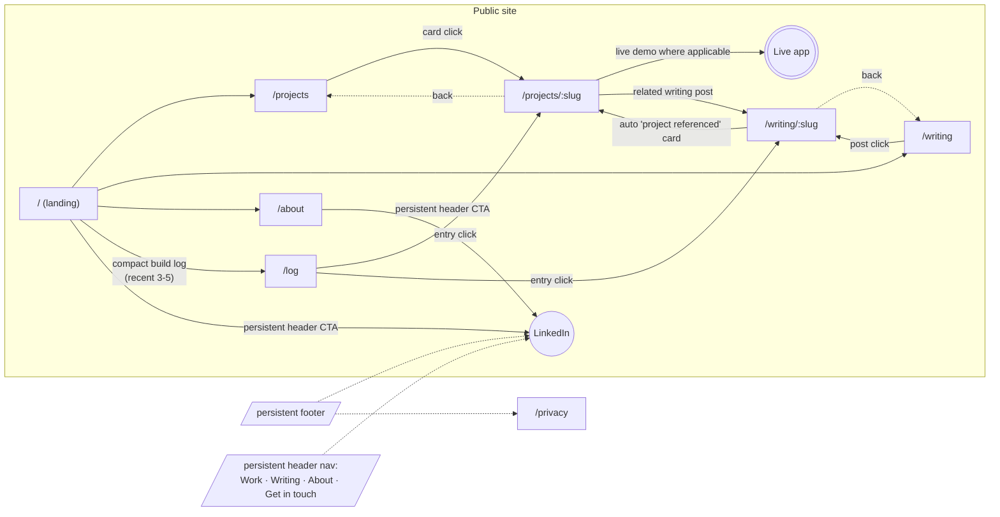
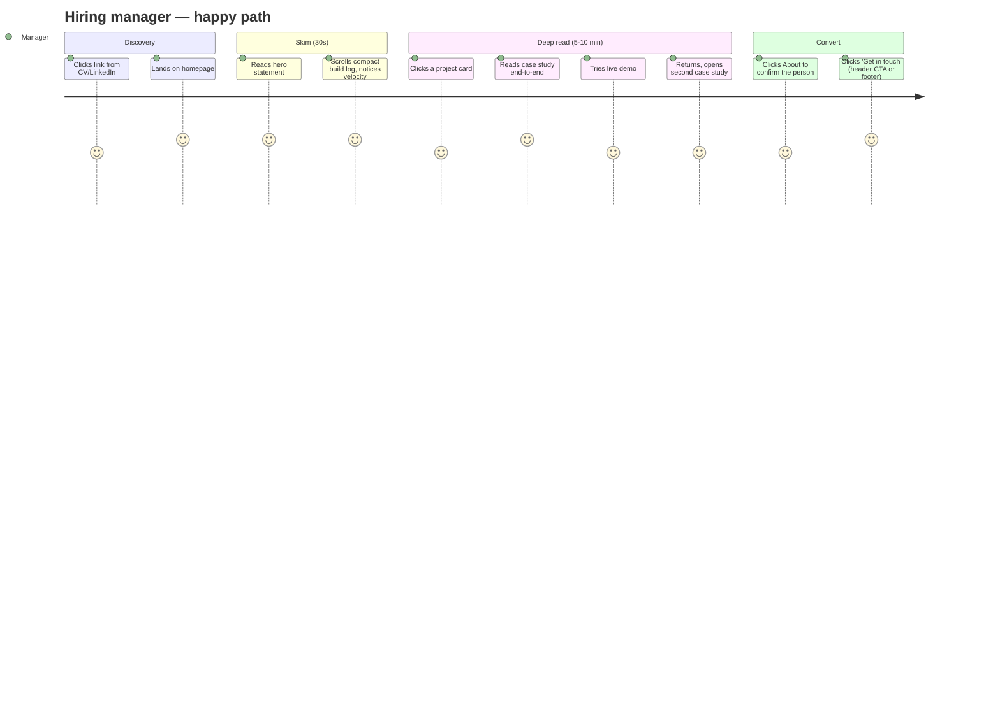
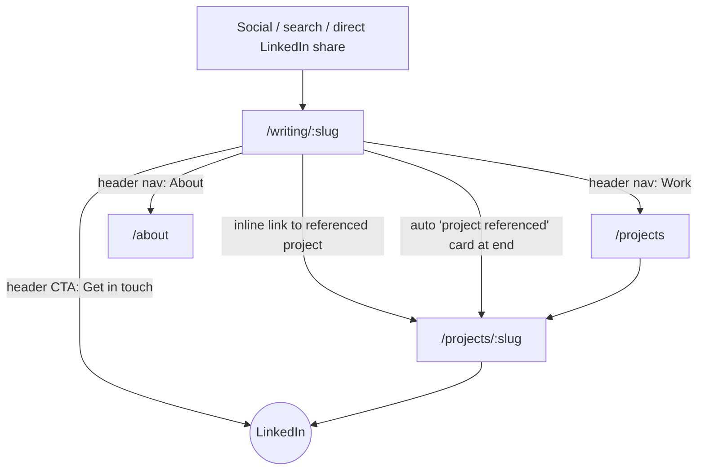
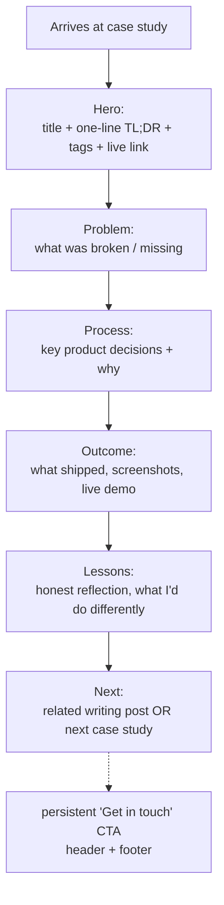
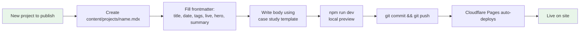

# Portfolio — UX Flows (Phase 4)

**Status:** approved 2026-04-10. Feeds Phase 5 (visual direction) and Phase 6 (architecture).

**North star:** *"This guy has great product decision-making and incredible capacity to learn"*
**Archetype:** POC front-end, greenfield
**Audience:** hiring managers doing deep review (not 30-second skimmers)

---

## 1. Site map

**Pages in v1:**
| Route | Purpose |
|---|---|
| `/` | Landing — hero statement + compact build log (recent 3-5 items) + "view full log" link |
| `/projects` | Projects index — card grid |
| `/projects/:slug` | Case study pages (the-weekly, planner-app full; workspace-audit, portfolio lightweight) |
| `/writing` | Writing index — chronological feed of curated dev-log posts |
| `/writing/:slug` | Individual writing post with auto "project referenced" card |
| `/about` | Typographic hero + bio + values + LinkedIn |
| `/log` | Full build log — chronological, all entries, paginated if needed |
| `/privacy` | Privacy policy (APP-required) |

**Decisions captured:**
- Projects ↔ writing posts cross-link bidirectionally. Every writing post that references a project auto-renders a "project referenced" card at the bottom (linking to the case study).
- `/log` is a full page. The landing page shows only a compact teaser (3-5 most recent) with a link through. This prevents the landing page from being dominated by a long scrolling list.
- Header nav carries a persistent "Get in touch" CTA button alongside Work / Writing / About. This is the quiet-but-always-visible conversion path.
- LinkedIn is the single contact channel. No form, no email, no newsletter.

---

## 2. Hiring manager happy path — emotional journey

**Three emotional beats, one per page group:**
| Beat | Page(s) | Evidence |
|---|---|---|
| **Recognition** — "this person has taste" | Landing, About | Hero statement, typographic confidence, build log velocity |
| **Conviction** — "this person makes good decisions" | Case studies | Problem → Process → Outcome → Lessons |
| **Action** — "I want to talk to them" | Header CTA, footer, end-of-case-study | LinkedIn link |

Each page reinforces exactly one beat. Pages that try to do more than one dilute the funnel.

**PostHog funnel measurement:**
`landing → /projects → /projects/:slug (scroll ≥80%) → /projects/:another (scroll ≥80%) → LinkedIn click`

---

## 3. Alternate entry — writing post as first page seen

**Why this matters:** a writing post shared on LinkedIn is likely the highest-traffic entry point. If a visitor can't get from a post to a case study in one click, the whole funnel leaks. The auto "project referenced" card at the bottom of every post is the mitigation.

---

## 4. Case study page anatomy — scaffold only

**Working template** — exact section names, weighting, and visual treatment to be decided in the Phase 7 **Case Study Workshop** (co-write the-weekly case study end-to-end, iterate, lock template, apply to remaining three).

**Targets:**
- Full case studies (the-weekly, planner-app): **400-600 words**, highly scannable
- Lightweight case studies (workspace audit, portfolio itself): **200-350 words**, meta-toned

**Deferred to Phase 5/6:**
- In-page sticky TOC (right-side section nav) — decide after seeing visual direction. Only considered for full case studies, not lightweight ones.

---

## 5. Maintainer flow — adding a new project or post

**Success criterion:** ≤30 minutes from idea to live. The template workshop in Phase 7 is the single biggest lever on this metric — a good template makes the "write body" step fast.

---

## Open decisions carried to Phase 5

| # | Decision | Resolution phase |
|---|---|---|
| Q4 | Case study sticky TOC (yes / no / full-only) | Phase 5 (visual direction) — decide once mood is set |
| Q5 | Mobile nav pattern (hamburger vs sticky top bar) | Phase 5 (visual direction) — leaning sticky top bar, decide with mockups |
| — | Dark mode vs light mode | Phase 5 — one mode only, decide from mood board |
| — | Case study section names + exact template | Phase 7 — Case Study Workshop |

---

## What's NOT in these flows (intentionally)

- No search flow (deferred from v1)
- No RSS / subscription flow (deferred from v1)
- No "view previous / next case study" pagination (handled via the "Next" slot at the end of each case study, not a full prev/next UI)
- No dark/light toggle flow (one mode only)
- No account / login / personalization
- No AI chatbot flow
- No multi-language flow
